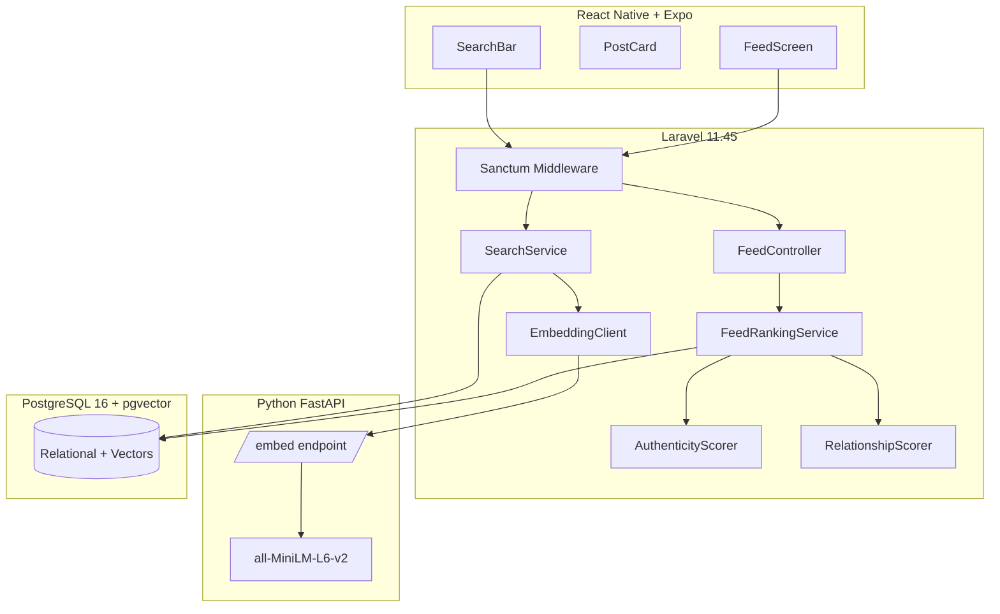
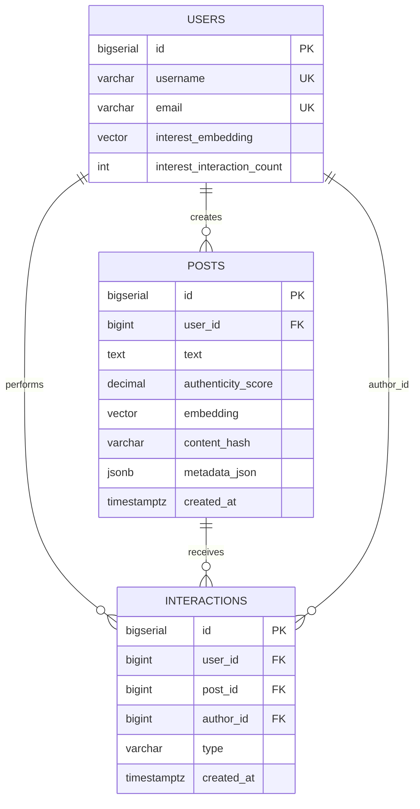
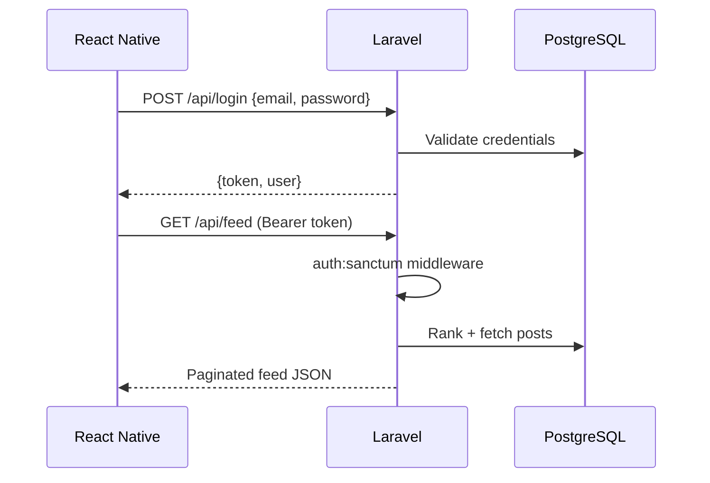
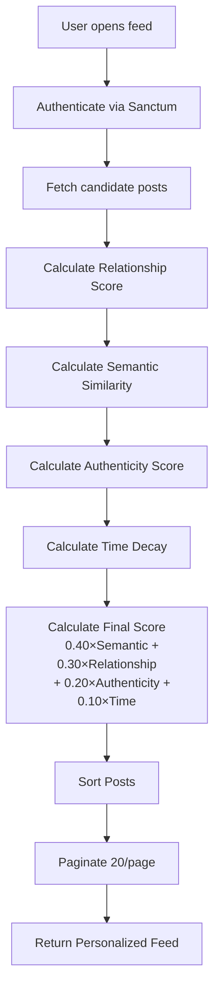

# Guised Up — Real Connections Feed
## Technical Solution Document (TSD) — Revision 2.0 (Frozen)

**Version:** 2.0  
**Status:** Architecture Frozen — Approved for Implementation  
**Date:** July 14, 2026  
**Scope:** Real Connections Feed — MVP designed for production evolution

---

## Document Control

| Version | Date | Changes |
|---------|------|---------|
| 1.0 | Jul 14, 2026 | Initial architecture |
| 2.0 | Jul 14, 2026 | Frozen stack versions, ranking weights, authenticity heuristics, coding standards, assignment compliance review |

**Implementation gate:** Architecture frozen. Implementation proceeds per approved spec.

---

## 1. Executive Summary

Guised Up is building a social platform where people show up **authentically** — not through curated highlight reels or follower-count anxiety. The **Real Connections Feed** is the core product surface: a personalized recommendation stream that surfaces content based on **who you genuinely connect with**, **what you care about**, and **how real the content feels** — never on popularity metrics.

This TSD defines a **production-ready MVP architecture** deliverable within the one-day assessment window and extensible to scale:

| Layer | Frozen Choice |
|-------|---------------|
| Mobile | React Native 0.76.5 + Expo SDK 52 |
| API | Laravel 11.45 on PHP 8.3.20 |
| ML / Embeddings | Python 3.12.8 + FastAPI 0.115.6 |
| Data | PostgreSQL 16.6 + pgvector 0.8.0 |
| Runtime | Node.js 22.14.0 LTS, Docker 27.4.0, Compose 2.32.1 |

**Ranking philosophy (frozen):** Personalized recommendation, not popularity ranking.

| Signal | Weight |
|--------|--------|
| Semantic Similarity | **40%** |
| Relationship Depth | **30%** |
| Authenticity | **20%** |
| Time Decay | **10%** |

**Deliverables mapped to assignment:** TSD, Laravel API (4 endpoints), Python embedding service, React Native Feed Screen, `/sql/queries.sql`, ≥3 tests, migrations, README, demo video, documented AI workflow.

---

## 2. Product Understanding

### 2.1 What Guised Up Is

A mobile-first social platform for **real people and real connections**. The feed is not a performance stage — it is a **personalized discovery engine** that answers: *"What should this specific person see right now that is most meaningful to them?"*

### 2.2 How Guised Up Differs from Instagram, Twitter/X, and LinkedIn

| Platform | Primary Ranking Logic | What It Optimizes | User Outcome |
|----------|----------------------|-------------------|--------------|
| **Instagram** | Engagement velocity (likes, saves, shares), recency, follow graph, ad inventory | Time-on-app, viral reach | Highlight reels; comparison anxiety |
| **Twitter/X** | Engagement + recency + social proof + trending topics | Hot takes, virality, discourse speed | Noise, pile-ons, performative posting |
| **LinkedIn** | Professional relevance, network proximity, engagement, promoted content | Career signaling, B2B reach | Performative professionalism |
| **Guised Up** | Authenticity + genuine relationship depth + semantic interest + gentle time decay | **Meaningful, personal surfacing** | Authentic connection without popularity contest |

#### The Core Difference: Recommendation ≠ Popularity

Traditional feeds use **popularity ranking** — content rises because *many people* engaged with it. That creates feedback loops favoring:
- Polished, filter-heavy content
- Influencer amplification
- Outrage and clickbait
- New-user cold-start failure (no followers = no reach)

Guised Up uses **personalized recommendation** — content rises because it is:
1. **Genuinely connected to you** (you actually interact with this person, not just follow them)
2. **Semantically relevant** (it matches topics you have shown interest in through weighted behavior)
3. **Authentically expressed** (unpolished, non-spammy, human)
4. **Reasonably fresh** (time matters, but never beats relevance)

> **A post with zero likes can rank #1 in your feed** if it is from someone you genuinely engage with, about something you care about, and written authentically. That is the product promise.

### 2.3 User Journeys (MVP)

| Journey | Flow |
|---------|------|
| Consume | Open app → personalized feed → infinite scroll → optional reaction |
| Search | Natural language query → semantic top-10 inline results |
| Create | Post text (+ optional image URL) → embedding + authenticity computed |
| Signal | View / reply / reaction logged → relationship + interest profile updated |

### 2.4 Success Criteria (MVP)

- Feed loads in < 800ms p95 (uncached), < 400ms with cache
- Search returns semantically relevant results for natural language queries
- No ranking input from like/comment/follower counts
- Interaction signals durably persisted and reflected in subsequent feeds

---

## 3. Functional Requirements

### 3.1 Explicit (Assignment)

| ID | Requirement |
|----|-------------|
| FR-01 | `GET /api/feed` — personalized, paginated feed (20/page) |
| FR-02 | Rank by authenticity, relationship depth, semantic similarity, time decay |
| FR-03 | **Must NOT** rank by likes, shares, comments, follower counts |
| FR-04 | `GET /api/search?q=` — top 10 semantic results |
| FR-05 | `POST /api/posts` — text + optional image URL |
| FR-06 | Auto-generate and store vector embedding on post create |
| FR-07 | `POST /api/interactions` — view, reply, reaction |
| FR-08 | Laravel Sanctum auth; ≥2 seeded users |
| FR-09 | PostgreSQL with reproducible migrations |
| FR-10 | Vector storage (pgvector) with documented choice |
| FR-11 | React Native Feed Screen: cards, infinite scroll, search, states |
| FR-12 | 4 SQL queries in `/sql/queries.sql` |
| FR-13 | ≥3 unit/feature tests on critical logic |
| FR-14 | README, `.env.example`, setup instructions |
| FR-15 | Demo video explaining features |
| FR-16 | Document AI agentic tool usage |

### 3.2 Derived

| ID | Requirement |
|----|-------------|
| FR-17 | `POST /api/login` for Sanctum token issuance |
| FR-18 | Exclude viewer's own posts from feed (configurable) |
| FR-19 | Graceful degradation if embedding service unavailable |
| FR-20 | Interaction logging on view (visibility) and reaction (tap) |
| FR-21 | Search time-hint parsing ("last week") |
| FR-22 | Soft-delete posts; exclude from feed/search |

---

## 4. Non-Functional Requirements

| ID | Category | MVP Target | Production Path |
|----|----------|------------|-----------------|
| NFR-01 | Performance | Feed p95 < 800ms | Precomputed feeds, Redis |
| NFR-02 | Scalability | 10K users / 100K posts | Async pipelines, read replicas |
| NFR-03 | Maintainability | Service-layer Laravel, typed RN | OpenAPI contracts |
| NFR-04 | Testability | ≥3 tests + ranking unit tests | CI pipeline, coverage gates |
| NFR-05 | Security | Sanctum, validation, rate limits | WAF, audit logs |
| NFR-06 | Observability | Structured JSON logs | APM, distributed tracing |
| NFR-07 | Reproducibility | Docker Compose one-command boot | K8s Helm charts |
| NFR-08 | Extensibility | Versioned embedding model column | Blue/green model rollout |

---

## 5. Assumptions

1. Single-region MVP; no multi-tenant isolation required.
2. All posts are public to authenticated users.
3. `image_url` is a string reference — no binary upload in MVP.
4. English-first content and search.
5. `share` interaction type is **schema-ready** but **UI-deferred** in MVP (weight defined for interest model).
6. Authenticity uses heuristics in MVP; CV-based image analysis is documented as Phase 2.
7. Server timestamps in UTC; client renders relative time.
8. No follow-graph table — relationship derived purely from interactions.
9. Assessment timebox (~8h) — sync embedding acceptable with documented async upgrade.

---

## 6. Constraints

| Constraint | Implication |
|------------|-------------|
| Stack: RN + Laravel + Python + SQL + Vector DB | Strict service boundaries |
| 1-day delivery | pgvector over managed SaaS; pragmatic shortcuts |
| Sanctum only | No OAuth in MVP |
| AI tools mandatory | Section 32 documents honest usage |
| Video required | Docker Compose + seed data for reliable demo |
| Confidential | No secrets in repo |

---

## 7. Architectural Principles

### 7.1 Separation of Concerns

| Concern | Owner |
|---------|-------|
| HTTP / Auth / Orchestration | Laravel |
| ML inference (embeddings) | Python FastAPI |
| Relational + vector persistence | PostgreSQL + pgvector |
| Presentation + client state | React Native |
| Analytics SQL | Raw SQL in `/sql` |

Laravel never loads ML models. Python never handles auth tokens. Mobile never computes ranking.

### 7.2 Scalability

- **Bounded candidate set** (500 recent posts) keeps scoring O(n) predictable.
- **Stateless API** instances scale horizontally behind a load balancer.
- **Embedding service** scales independently (CPU-bound).
- **pgvector HNSW** index scales to hundreds of thousands of vectors before requiring dedicated vector SaaS.
- **Interaction append-only** design supports future event streaming (Kafka/Kinesis).

### 7.3 Maintainability

- PSR-12 PHP, service layer, thin controllers.
- Shared API contracts documented in TSD and README.
- Embedding model version tracked in DB for reproducibility.
- Docker Compose for identical dev/prod-demo environments.

### 7.4 Testability

- `FeedRankingService` is pure, injectable, unit-testable.
- Feature tests cover auth-gated endpoints.
- Python embedder tested for dimension consistency.
- Ranking weights configured via config file — tunable without code changes.

### 7.5 Extensibility

- `InteractionType` enum extensible (`share` ready).
- `AuthenticityScorer` pluggable rules (new heuristics = new rule class).
- `EmbeddingClient` interface supports `mock`, `local`, `openai` providers.
- `metadata_json` on posts supports future CV scores without schema migration.

### 7.6 Security-First Design

- All mutations authenticated and validated.
- Rate limiting on post create, search, interactions.
- Embedding service on internal network only.
- Parameterized queries exclusively — no raw user input in SQL.
- Tokens never logged; passwords bcrypt only.

---

## 8. High-Level System Architecture

```
┌──────────────────────────────────────────────────────────────────────────┐
│                     React Native 0.76 + Expo SDK 52                      │
│           FeedScreen │ SearchBar │ PostCard │ Infinite Scroll            │
└───────────────────────────────┬──────────────────────────────────────────┘
                                │ HTTPS / JSON
                                ▼
┌──────────────────────────────────────────────────────────────────────────┐
│                   Laravel 11.45 API (PHP 8.3)                            │
│  Sanctum │ PostController │ FeedController │ SearchController │         │
│  InteractionController │ FeedRankingService │ AuthenticityScorer        │
└───────┬──────────────────────────────┬──────────────────────┬──────────────┘
        │ SQL                          │ HTTP (internal)      │ SQL
        ▼                              ▼                      ▼
┌───────────────────────┐    ┌─────────────────────┐   ┌─────────────────┐
│ PostgreSQL 16.6       │    │ FastAPI 0.115.6     │   │ Redis 7.4       │
│ + pgvector 0.8.0      │◄───│ Python 3.12.8       │   │ (optional cache)│
│ users, posts,         │    │ MiniLM-L6-v2        │   └─────────────────┘
│ interactions          │    └─────────────────────┘
└───────────────────────┘
```

---

## 9. Architecture Diagram



---

## 10. Technology Stack — Frozen Versions

| Technology | Frozen Version | Why This Version |
|------------|----------------|------------------|
| **Laravel** | **11.45** | Mature 11.x release; Sanctum, migrations, PHPUnit, HTTP client all battle-tested; stable for MVP without 12.x migration risk during assessment |
| **PHP** | **8.3.20** | Required by Laravel 11; JIT improvements, `json_validate`, readonly class refinements; 8.4 skipped to maximize package compatibility on day one |
| **Python** | **3.12.8** | Stable performance gains over 3.11; broad `sentence-transformers` wheel support; long support window |
| **FastAPI** | **0.115.6** | Async-native, automatic OpenAPI schema, Pydantic v2 validation; minimal boilerplate for single-purpose embedding service |
| **Uvicorn** | **0.32.1** | ASGI server paired with FastAPI 0.115.x; production-grade with workers |
| **sentence-transformers** | **3.3.1** | Compatible with MiniLM; local inference, no API cost |
| **Embedding model** | **all-MiniLM-L6-v2** | 384 dimensions; fast CPU inference; strong semantic quality for short social text |
| **React Native** | **0.76.5** | New Architecture stable; improved FlatList performance critical for infinite scroll |
| **Expo** | **SDK 52** | Managed workflow; fastest assessment bootstrap; EAS-compatible for demo builds |
| **Node.js** | **22.14.0 LTS** | Required for RN/Expo tooling; LTS guarantees through April 2027; matches Metro bundler requirements |
| **PostgreSQL** | **16.6** | Mature JSONB, excellent planner; pgvector extension fully supported |
| **pgvector** | **0.8.0** | HNSW indexes, `halfvec` support; single-DB relational + vector eliminates dual-store complexity for MVP |
| **Redis** | **7.4.2** | Optional feed cache; standard Alpine image |
| **Docker Engine** | **27.4.0** | Current stable; BuildKit, compose v2 native |
| **Docker Compose** | **2.32.1** | Multi-service orchestration for Laravel + Python + Postgres + Redis |
| **PHPUnit** | **11.5** | Ships with Laravel 11; feature + unit tests |
| **Pest** | **3.7** | Optional expressive test syntax on top of PHPUnit |

### Vector DB Decision: pgvector 0.8.0 (Frozen)

| Criterion | pgvector | Pinecone / Qdrant |
|-----------|----------|-------------------|
| Infra complexity | One Postgres instance | Additional managed service |
| SQL joins (post + author + filter) | Native | Application-side join |
| Assessment setup time | < 15 minutes | Account + API + sync |
| Cost at MVP scale | $0 | Free tier limits |
| 1M+ vector scale | Requires tuning | Managed |

**Verdict:** pgvector 0.8.0 on PostgreSQL 16.6. Migration trigger: >500K vectors with search p95 > 200ms, or need for multi-region vector replication.

---

## 11. Project Folder Structure

```
guised-up/
├── docs/
│   ├── TSD.md
│   └── api-contracts.md
├── docker/
│   ├── docker-compose.yml
│   ├── Dockerfile.laravel
│   ├── Dockerfile.embedding
│   └── postgres/
│       └── init.sql
├── scripts/
│   ├── setup.sh
│   ├── seed-demo.sh
│   ├── run-tests.sh
│   └── wait-for-it.sh
├── shared/
│   └── contracts/
│       ├── embedding-api.openapi.json
│       └── interaction-types.json
├── backend/
│   ├── app/
│   │   ├── Http/
│   │   │   ├── Controllers/
│   │   │   ├── Middleware/
│   │   │   └── Requests/
│   │   ├── Models/
│   │   ├── Services/
│   │   │   └── Embedding/
│   │   ├── Enums/
│   │   ├── Exceptions/
│   │   └── Support/
│   ├── config/
│   ├── database/
│   │   ├── migrations/
│   │   └── seeders/
│   ├── routes/
│   ├── tests/
│   │   ├── Unit/
│   │   └── Feature/
│   ├── .env.example
│   └── composer.json
├── embedding-service/
│   ├── app/
│   ├── tests/
│   ├── requirements.txt
│   ├── Dockerfile
│   └── .env.example
├── mobile/
│   ├── src/
│   │   ├── screens/
│   │   ├── components/
│   │   ├── api/
│   │   ├── hooks/
│   │   ├── theme/
│   │   └── types/
│   ├── App.tsx
│   ├── app.json
│   ├── package.json
│   └── .env.example
├── sql/
│   └── queries.sql
├── .gitignore
└── README.md
```

### `shared/` Justification

Polyglot stack (PHP + Python + TypeScript) risks contract drift. `shared/contracts/` holds the **embedding API OpenAPI spec** and **interaction type enum** as the single source of truth both Laravel and Python reference. No shared runtime code — contracts only.

---

## 12. Database Design

### 12.1 `users`

| Column | Type | Notes |
|--------|------|-------|
| id | BIGSERIAL PK | |
| name | VARCHAR(255) | |
| username | VARCHAR(50) UNIQUE | Feed display |
| email | VARCHAR(255) UNIQUE | Auth + spam SQL |
| password | VARCHAR(255) | bcrypt |
| avatar_url | VARCHAR(500) NULL | Placeholder circle if null |
| interest_embedding | vector(384) NULL | Weighted interest profile |
| interest_interaction_count | INTEGER DEFAULT 0 | Denominator for weighted average |
| created_at | TIMESTAMPTZ | |
| updated_at | TIMESTAMPTZ | |

### 12.2 `posts`

| Column | Type | Notes |
|--------|------|-------|
| id | BIGSERIAL PK | |
| user_id | BIGINT FK → users | Author |
| text | TEXT NOT NULL | |
| image_url | VARCHAR(500) NULL | |
| authenticity_score | DECIMAL(5,4) | 0.0000–1.0000 |
| authenticity_breakdown | JSONB | Per-rule scores for debugging |
| embedding | vector(384) NULL | Populated after embed |
| embedding_model | VARCHAR(100) | e.g. `all-MiniLM-L6-v2` |
| embedding_status | VARCHAR(20) | `pending`, `completed`, `failed` |
| content_hash | VARCHAR(64) | SHA-256 for duplicate detection |
| metadata_json | JSONB | Parsed text features |
| created_at | TIMESTAMPTZ | |
| updated_at | TIMESTAMPTZ | |
| deleted_at | TIMESTAMPTZ NULL | Soft delete |

### 12.3 `interactions`

| Column | Type | Notes |
|--------|------|-------|
| id | BIGSERIAL PK | |
| user_id | BIGINT FK → users | Actor |
| post_id | BIGINT FK → posts | |
| author_id | BIGINT FK → users | Denormalized for relationship queries |
| type | VARCHAR(20) | `view`, `reply`, `reaction`, `share` |
| created_at | TIMESTAMPTZ | |

**Constraints:**
- UNIQUE (`user_id`, `post_id`, `type`) WHERE type IN (`reaction`, `share`) — prevent duplicate strong signals
- Views are append-only (multiple views allowed) OR deduplicated client-side per session

### 12.4 `personal_access_tokens` (Sanctum)

Laravel default migration.

---

## 13. Entity Relationship Diagram



---

## 14. Indexing Strategy

| Index | Table | Definition | Purpose |
|-------|-------|------------|---------|
| PK | all | `id` | Default |
| `idx_posts_created_at` | posts | `(created_at DESC)` WHERE `deleted_at IS NULL` | Feed candidate window |
| `idx_posts_user_created` | posts | `(user_id, created_at DESC)` | Author timeline |
| `idx_posts_content_hash` | posts | `(user_id, content_hash)` | Duplicate detection |
| `idx_interactions_user_author` | interactions | `(user_id, author_id, created_at DESC)` | Relationship depth |
| `idx_interactions_post_type` | interactions | `(post_id, type)` | D3 view/reaction counts |
| `idx_interactions_created` | interactions | `(created_at)` | D1 7-day window |
| `idx_users_email` | users | `(email)` | D4 spam lookup |
| `idx_posts_embedding_hnsw` | posts | HNSW `embedding vector_cosine_ops` | Semantic search |

```sql
CREATE INDEX idx_posts_embedding_hnsw ON posts
USING hnsw (embedding vector_cosine_ops)
WITH (m = 16, ef_construction = 64);
```

---

## 15. Authentication Flow



- **Laravel Sanctum 4.x** personal access tokens.
- All `/api/*` routes except `/login` require `Authorization: Bearer {token}`.
- MVP: Login screen or dev-token via `.env` for rapid demo.
- Rate limit: 60 requests/minute/user on authenticated routes.

---

## 16. API Design

### `POST /api/login`
```json
// Request
{ "email": "aditi@guisedup.test", "password": "password" }
// Response 200
{ "token": "1|abc...", "user": { "id": 1, "username": "aditi" } }
```

### `POST /api/posts`
```json
// Request
{ "text": "No filters today. Just me and the monsoon.", "image_url": null }
// Response 201
{
  "data": {
    "id": 42,
    "text": "...",
    "authenticity_score": 0.91,
    "embedding_status": "completed",
    "author": { "id": 1, "username": "aditi", "avatar_url": null },
    "created_at": "2026-07-13T10:00:00Z"
  }
}
```

### `GET /api/feed?page=1&per_page=20`
```json
// Response 200
{
  "data": [
    {
      "id": 10,
      "text": "...",
      "image_url": null,
      "created_at": "2026-07-13T09:00:00Z",
      "time_ago": "2h ago",
      "author": { "id": 2, "username": "rahul", "avatar_url": null }
    }
  ],
  "meta": { "current_page": 1, "per_page": 20, "has_more": true }
}
```

### `GET /api/search?q=funny+travel+stories+from+last+week`
```json
// Response 200
{
  "data": [
    {
      "id": 5,
      "text": "...",
      "similarity_score": 0.89,
      "created_at": "2026-07-10T14:00:00Z",
      "author": { "id": 2, "username": "rahul", "avatar_url": null }
    }
  ],
  "meta": {
    "query": "funny travel stories from last week",
    "time_filter": { "from": "2026-07-06T00:00:00Z" }
  }
}
```

### `POST /api/interactions`
```json
// Request
{ "post_id": 10, "type": "reaction" }
// Response 201
{ "data": { "id": 100, "post_id": 10, "type": "reaction", "created_at": "..." } }
```

**Side effects:** Updates weighted `interest_embedding` on reply/reaction (and share when implemented).

---

## 17. Recommendation Engine — Philosophy & Workflow

### 17.1 Recommendation, Not Popularity

Guised Up's engine is a **personalized recommender** — like Netflix recommending *for you*, not Billboard ranking *for everyone*. The input signals are **private behavioral affinity** (your interactions), **semantic interest** (what topics you engage with), and **content quality** (authenticity) — never **public engagement counts**.

### 17.2 Recommendation Workflow

```
User opens feed
      ↓
Authenticate (Sanctum)
      ↓
Fetch candidate posts (last 30 days, not deleted, exclude own posts, cap 500)
      ↓
Calculate Relationship Score (per author, from interaction history)
      ↓
Calculate Semantic Similarity (post.embedding ↔ user.interest_embedding)
      ↓
Calculate Authenticity Score (precomputed at post creation)
      ↓
Calculate Time Decay (exponential decay from post age)
      ↓
Calculate Final Score (weighted sum)
      ↓
Sort Posts (score DESC, created_at DESC tie-break)
      ↓
Paginate (20 per page)
      ↓
Return Personalized Feed
```



### 17.3 Post-Interaction Feedback Loop

```
User views / reacts / replies
      ↓
Log interaction (append to interactions table)
      ↓
Update relationship score cache (author-level)
      ↓
Update weighted user interest embedding
      ↓
Future feed requests reflect stronger relationship + refined interests
```

---

## 18. Feed Ranking Algorithm

### 18.1 Frozen Weights

| Signal | Weight | Symbol |
|--------|--------|--------|
| **Semantic Similarity** | **40%** | wₛ |
| **Relationship Depth** | **30%** | wᵣ |
| **Authenticity** | **20%** | wₐ |
| **Time Decay** | **10%** | wₜ |
| **Total** | **100%** | |

Stored in `config/feed.php` — tunable without redeploying logic.

### 18.2 Weight Justification

**Semantic Similarity — 40% (highest)**

Guised Up must answer *"What topics does this person care about?"* above all else. A user who consistently engages with travel and vulnerability should see more of that — even from people they have not interacted with recently. Semantic similarity is the **primary personalization lever** and differentiates the feed from a simple chronological friend list. At 40%, it ensures the feed feels *tailored to you*, not just *people you know*.

**Relationship Depth — 30%**

Authentic connection requires **genuine relationships**, not passive follows. A high weight (30%) ensures people you *actually* engage with surface prominently — but deliberately **below** semantic similarity so the feed does not become a closed club. You discover new authentic content within your interest space, while people you genuinely connect with get a strong boost.

**Authenticity — 20%**

Authenticity is a **brand promise**, not the primary ranking driver. At 20%, it acts as a **quality filter** — spammy, over-polished, promotional content is suppressed — without overriding relevance. Two equally relevant posts rank higher for the more authentic one.

**Time Decay — 10% (lowest)**

Newer content is preferred, but **never at the expense of relevance**. At only 10%, a deeply relevant post from 5 days ago beats a weak post from 1 hour ago. This directly counters Instagram/Twitter recency bias that fuels anxiety and endless scrolling.

> **Design invariant:** No term in the formula uses like_count, comment_count, share_count, or follower_count.

### 18.3 Sub-Score Formulas

**Semantic (S):**  
`S = clamp(cosine_similarity(post.embedding, user.interest_embedding), 0, 1)`  
Cold start (null interest): `S = 0.5`

**Relationship (R):**  
`raw = Σ weight(type) for interactions(user → author) in last 90 days`  
`R = min(1, log(1 + raw) / log(1 + 50))`

Interaction weights for relationship:
| Type | Weight |
|------|--------|
| view | 1 |
| reaction | 3 |
| reply | 5 |
| share | 8 |

**Authenticity (A):**  
`A = post.authenticity_score` (precomputed 0–1)

**Time Decay (T):**  
`T = exp(-age_hours / 168)` — 7-day characteristic decay

**Final:**  
`FINAL = 0.40×S + 0.30×R + 0.20×A + 0.10×T`

### 18.4 Pseudocode

```
function getFeed(userId, page, perPage):
    user = loadUser(userId)
    candidates = queryPosts(
        created_at >= now() - 30 days,
        deleted_at IS NULL,
        user_id != userId,
        LIMIT 500,
        ORDER BY created_at DESC
    )

    authorIds = unique(candidates.map(p => p.user_id))
    relationshipMap = RelationshipScorer.score(userId, authorIds)

    scored = []
    for post in candidates:
        S = cosineSim(post.embedding, user.interest_embedding) ?? 0.5
        R = relationshipMap[post.user_id] ?? 0.0
        A = post.authenticity_score
        T = exp(-hoursSince(post.created_at) / 168)
        FINAL = 0.40*S + 0.30*R + 0.20*A + 0.10*T
        scored.append({ post, FINAL })

    sort scored by FINAL desc, then created_at desc
    return paginate(scored, page, perPage)
```

---

## 19. Authenticity Score — Expanded Heuristics

`AuthenticityScorer` runs at post creation. Each rule returns a penalty (0–1). Final score:

`authenticity_score = clamp(1.0 - Σ(penalty × rule_weight), 0, 1)`

### 19.1 Text Heuristics (MVP)

| Rule | Detection | Penalty Weight | Rationale |
|------|-----------|----------------|-----------|
| **Excessive hashtags** | `hashtag_count > 5` | 0.25 | Authentic posts rarely spam tags for reach |
| **Excessive emojis** | `emoji_count > 10` or emoji:text ratio > 0.3 | 0.15 | Performative expression signal |
| **Promotional language** | Regex: `buy now`, `discount`, `link in bio`, `DM me`, `follow for` | 0.30 | Guised Up is not a marketplace |
| **Repeated punctuation** | `!!+`, `??+`, `...{4,}` | 0.10 | Engagement-bait pattern |
| **ALL CAPS** | >60% uppercase in words >3 chars | 0.20 | Shouting / outrage bait |
| **Duplicate content** | `content_hash` matches prior post by same user within 7 days | 0.40 | Low-effort spam |
| **Spam velocity** | User has >10 posts in last hour (soft check) | 0.35 | Rate-based spam signal |
| **Very short text** | < 10 characters with no image | 0.15 | Low-effort content |
| **URL flooding** | > 3 URLs in text | 0.20 | Link spam |

### 19.2 Image Heuristics (MVP — Metadata Only)

| Rule | Detection | Penalty Weight | Rationale |
|------|-----------|----------------|-----------|
| **Stock image URL patterns** | Known CDN/stock domains | 0.20 | Non-personal content |
| **Missing image metadata** | `image_url` present, no authenticity signal | 0.05 | Neutral slight penalty |

### 19.3 Phase 2: AI-Based Image Authenticity

```
image_url → CV Pipeline:
  1. EXIF analysis (filter app signatures: VSCO, FaceTune, etc.)
  2. Frequency domain analysis (heavy smoothing / beauty filter detection)
  3. GAN-generated image classifier
  4. Screenshot-of-screenshot detection
→ image_authenticity_score (0–1)
→ blended: final_A = 0.6 × text_authenticity + 0.4 × image_authenticity
```

Stored in `metadata_json.image_authenticity` when available. MVP stores `image_filter_score: null` with documented upgrade path.

### 19.4 Worked Example

Post: `"BUY NOW!!! 🔥🔥🔥 #ad #sponsored #deal #sale #linkinbio 🤑🤑🤑🤑🤑"`

| Rule triggered | Penalty |
|----------------|---------|
| Excessive hashtags (6) | 0.25 |
| Excessive emojis (8+, high ratio) | 0.15 |
| Promotional language | 0.30 |
| Repeated punctuation | 0.10 |
| **Total penalties** | **0.80** |
| **authenticity_score** | **0.20** |

This post ranks low regardless of engagement — by design.

---

## 20. User Interest Profile — Weighted Embedding

### 20.1 Why Not a Simple Average?

A simple mean treats a passive scroll-past (view) equal to a thoughtful reply. That dilutes the interest signal with noise. Guised Up's interest model must reflect **intent strength** — stronger interactions indicate genuine topic affinity.

### 20.2 Interaction Weights (Frozen)

| Interaction | Weight | Meaning |
|-------------|--------|---------|
| **View** | 1 | Passive exposure — weak signal |
| **Reaction** | 3 | Active acknowledgment — moderate signal |
| **Reply** | 5 | Conversational investment — strong signal |
| **Share** | 8 | Highest endorsement — strongest signal |

### 20.3 Weighted Update Formula

On interaction with `post` by `user` with weight `w_type`:

```
if user.interest_embedding IS NULL:
    user.interest_embedding = post.embedding
    user.interest_interaction_count = w_type
else:
    n = user.interest_interaction_count
    user.interest_embedding = normalize(
        (user.interest_embedding × n + post.embedding × w_type) / (n + w_type)
    )
    user.interest_interaction_count = n + w_type
```

**Why stronger interactions weigh more:** A reply (5×) moves the interest vector **five times** as much as a view (1×). A user who replies to vulnerable travel posts but only views fitness posts will have an interest embedding dominated by vulnerability + travel — exactly matching the product vision of *genuine* preference, not *accidental* exposure.

### 20.4 Cold Start

- New user: `interest_embedding = NULL` → semantic score defaults to 0.5 (neutral).
- After first weighted interaction: embedding initialized to first engaged post.
- After ~10+ weighted interactions: profile stabilizes meaningfully.

---

## 21. Semantic Search Design

1. Parse time hints from query (`TimeQueryParser`).
2. Embed query via Python service (same model as posts).
3. pgvector cosine search: `ORDER BY embedding <=> query_vec LIMIT 10`.
4. Apply optional `created_at` filter.
5. Return results with `similarity_score`.

**Not keyword search.** Query *"funny travel stories from last week"* matches semantically similar content even if the word "funny" never appears.

---

## 22. Vector Embeddings Design

| Aspect | Decision |
|--------|----------|
| Model | `all-MiniLM-L6-v2` (384 dims) |
| Post input | `post.text` (image caption Phase 2) |
| Storage | `posts.embedding vector(384)` |
| Index | HNSW cosine |
| Normalization | L2-normalize before storage |
| Model version | `posts.embedding_model` column |
| Mock fallback | `MockEmbeddingClient` — deterministic hash → unit vector; documented in README |

---

## 23. Backend Architecture (Laravel)

```
Routes → Middleware (Sanctum, throttle) → Controllers (thin)
    → Form Requests (validation)
    → Services (business logic)
        → Models / Query Builder
        → EmbeddingClient (HTTP → FastAPI)
```

| Service | Responsibility |
|---------|----------------|
| `FeedRankingService` | Candidate fetch, score, sort, paginate |
| `AuthenticityScorer` | Rule-based scoring at post create |
| `RelationshipScorer` | Aggregated interaction weights per author |
| `SearchService` | Time parse + embed + vector query |
| `InteractionService` | Persist interaction + update interest embedding |
| `EmbeddingClient` | HTTP to FastAPI with retry + fallback |

**Ranking stays in PHP** — product logic, fast to unit test. Python handles inference only.

---

## 24. Python Embedding Service Architecture

```
POST /embed         { "text": "..." }         → { "embedding": [384 floats], "model": "..." }
POST /embed/batch   { "texts": ["...", "..."] } → { "embeddings": [[...], [...]] }
GET  /health        → { "status": "ok", "model": "all-MiniLM-L6-v2", "version": "3.3.1" }
```

- Model loaded once at startup (warm container).
- Max input: 512 tokens (truncate with log warning).
- Timeout: 5 seconds.
- Internal Docker network only — not exposed publicly.

---

## 25. React Native Architecture

```
FeedScreen
├── SearchBar (debounced 300ms, inline results mode)
├── FlatList (infinite scroll, onEndReached → page++)
│   └── PostCard
│       ├── AvatarPlaceholder (initials circle)
│       ├── Username
│       ├── Post text
│       ├── Time ago
│       └── Reaction button → POST /api/interactions
├── LoadingState (skeleton cards)
├── EmptyState
└── ErrorState (retry)
```

- **FlatList** with `onViewableItemsChanged` → debounced view logging.
- **TanStack Query** for feed pagination and search cache.
- **Custom theme** — warm earth tones; no default RN blue.
- Search mode toggles FlatList data source (feed vs search results).

---

## 26. Data Flow

### Feed
`App → GET /api/feed → Sanctum → FeedRankingService → score 500 candidates → page 20 → JSON → FlatList`

### Post Create
`POST /api/posts → AuthenticityScorer → INSERT → FastAPI /embed → UPDATE embedding → 201`

### Search
`GET /api/search?q= → TimeQueryParser → FastAPI /embed → pgvector top 10 → JSON`

### Interaction
`POST /api/interactions → INSERT → update interest_embedding (weighted) → 201`

---

## 27. Coding Standards

### 27.1 SOLID Principles

| Principle | Application |
|-----------|-------------|
| **S** — Single Responsibility | `AuthenticityScorer` scores; `FeedRankingService` ranks; controllers route only |
| **O** — Open/Closed | New authenticity rule = new class implementing `AuthenticityRuleInterface`; no scorer modification |
| **L** — Liskov Substitution | `HttpEmbeddingClient` and `MockEmbeddingClient` interchangeable via `EmbeddingClientInterface` |
| **I** — Interface Segregation | Small interfaces: `EmbeddingClientInterface`, `AuthenticityRuleInterface` |
| **D** — Dependency Inversion | Services depend on interfaces; bound in Laravel service container |

### 27.2 Clean Architecture (Pragmatic MVP)

```
Presentation (Controllers, Requests)
    ↓
Application (Services: FeedRanking, Search, Interaction)
    ↓
Domain (Models, Enums, Scoring rules)
    ↓
Infrastructure (EmbeddingClient HTTP, PostgreSQL, Redis)
```

Controllers never contain scoring math. Services never return HTTP responses.

### 27.3 PSR-12

- `backend/` enforces PSR-12 via Laravel Pint (`./vendor/bin/pint`).
- 4-space indentation, camelCase methods, PascalCase classes.
- One class per file; namespace mirrors directory.

### 27.4 Service Layer

All business logic in `app/Services/`. Controllers:
1. Validate (Form Request)
2. Delegate to service
3. Return API Resource / JSON response

### 27.5 Repository Pattern

**Not used in MVP.** Eloquent models with scoped query methods are sufficient at this scale. Introduce repositories if:
- Query logic exceeds ~20 lines across 3+ controllers
- Testing requires complex DB mocking

**Decision:** YAGNI — direct Eloquent in services with extracted query scopes.

### 27.6 REST API Conventions

| Convention | Standard |
|------------|----------|
| URLs | Plural nouns: `/api/posts`, `/api/feed`, `/api/interactions` |
| Methods | GET read, POST create/action |
| Status codes | 200 OK, 201 Created, 401 Unauthorized, 422 Validation, 503 Service Unavailable |
| Response envelope | `{ "data": ..., "meta": ... }` |
| Errors | `{ "message": "...", "errors": { "field": ["..."] } }` |
| Pagination | `?page=1&per_page=20` + `meta.has_more` |
| Auth | `Authorization: Bearer {token}` |

### 27.7 Validation Strategy

- **Server:** Laravel Form Requests for every mutating endpoint.
- **Client:** TypeScript types + basic empty-check before submit.
- **Enum validation:** `type` must be in `view|reply|reaction|share`.
- **Post text:** required, 1–5000 chars.
- **image_url:** nullable, valid URL format.

### 27.8 Exception Handling

| Exception | HTTP | Handler |
|-----------|------|---------|
| `ValidationException` | 422 | Laravel default |
| `AuthenticationException` | 401 | Sanctum middleware |
| `ModelNotFoundException` | 404 | `{ "message": "Post not found" }` |
| `EmbeddingUnavailableException` | 201 (post) / 503 (search) | Post saved with `embedding_status: pending` |
| Unhandled | 500 | Log + generic message (no stack trace in response) |

### 27.9 Logging Strategy

Structured JSON via Monolog:

```json
{
  "level": "info",
  "event": "feed.ranked",
  "user_id": 1,
  "candidates": 500,
  "duration_ms": 118,
  "request_id": "550e8400-e29b"
}
```

| Event | Level |
|-------|-------|
| `feed.ranked` | info |
| `search.executed` | info |
| `interaction.logged` | info |
| `embedding.failed` | warning |
| `embedding.fallback_mock` | warning |
| Unhandled exception | error |

**Never log:** tokens, passwords, raw embeddings.

---

## 28. Security Considerations

| Risk | Mitigation |
|------|------------|
| Token theft | HTTPS; SecureStore for tokens in production |
| SQL injection | Eloquent / parameterized queries only |
| Mass assignment | `$fillable` whitelist on models |
| Rate abuse | Throttle: 10 posts/hour, 30 searches/min, 100 interactions/min |
| Embedding SSRF | Python service has no outbound URL fetch |
| XSS | RN `Text` component escapes; no `dangerouslySetInnerHTML` |
| Spam | Authenticity scorer + D4 SQL + rate limits |

---

## 29. Performance Optimizations

| Optimization | MVP | Production |
|--------------|-----|------------|
| Candidate cap 500 | ✓ | Cursor-based incremental |
| HNSW pgvector index | ✓ | Tune `ef_search` |
| Relationship map pre-aggregation | Single GROUP BY per feed | Materialized view / Redis cache |
| Feed page 1 Redis cache (60s) | Optional | Required at scale |
| Eager load `author` | ✓ | DataLoader |
| Async embedding queue | Documented | Laravel Horizon |

**Latency budget:** DB 80ms + scoring 20ms + serialize 10ms ≈ **110ms** server-side.

---

## 30. Error Handling Strategy

### API Error Envelope
```json
{
  "message": "Validation failed.",
  "errors": { "text": ["The text field is required."] },
  "code": "VALIDATION_ERROR"
}
```

### Client States
| State | Trigger | UX |
|-------|---------|-----|
| Loading | Initial fetch | Skeleton cards |
| Empty | Zero posts | "Nothing here yet — share something real." |
| Error | Network / 5xx | Retry button |
| Search empty | Zero results | "No stories match — try different words." |
| Search error | 503 | "Search unavailable. Try again." |

---

## 31. Testing Strategy

### Frozen Minimum (≥3)

| # | Test | Type | Asserts |
|---|------|------|---------|
| 1 | `FeedRankingServiceTest` | Unit | Correct sort order given known S/R/A/T inputs |
| 2 | `SearchApiTest` | Feature | Auth'd search returns semantically ordered results |
| 3 | `InteractionApiTest` | Feature | Reaction persisted; interest embedding updated |

### Additional

| Test | Type |
|------|------|
| `AuthenticityScorerTest` | Unit — promotional text scores < 0.5 |
| `PostApiTest` | Feature — post created + embedding stored |
| `FeedApiTest` | Feature — 401 without token |
| `test_embedder.py` | Unit — output dimension = 384 |

---

## 32. AI Agent Workflow

| Tool | Role |
|------|------|
| **Cursor (Agent)** | TSD authoring, Laravel scaffold, RN components, SQL queries, Docker Compose, tests |
| **Claude** | Ranking weight analysis, authenticity rule design, edge case review |
| **GitHub Copilot** | Inline completion for boilerplate (migrations, types) |

### Workflow
1. **Architecture (this TSD)** — human-directed, no code
2. **Freeze** — explicit approval gate
3. **Scaffold** — agent generates migrations, models, Docker from frozen spec
4. **Critical logic** — human reviews `FeedRankingServiceTest` before trusting implementation
5. **Integration** — agent wires services; human runs end-to-end demo
6. **Video** — human records; agent helps script

**Honesty policy:** Document exactly which sections were agent-generated vs human-reviewed. Evaluators value judgment, not just speed.

---

## 33. README Planning

The `README.md` contains:

- **Project Overview** — product context and assessment scope
- **Architecture** — stack table, ranking weights, vector DB rationale
- **Prerequisites** — Docker, Node.js, optional PHP/Python
- **Setup Instructions** — clone, env copy, docker compose, migrate/seed
- **Environment Variables** — per-service tables
- **Running Backend** — Docker and local commands
- **Running Python Service** — Docker and local commands
- **Running Mobile App** — Expo start
- **Running Tests** — `scripts/run-tests.sh`
- **Docker** — compose file, port mapping
- **API Endpoints** — method, path, description, auth
- **SQL Queries** — D1–D4 reference
- **AI Tools Used** — honest documentation
- **Demo Video** — link placeholder
- **Known Limitations** — deferred items

---

## 34. SQL Challenge — Query Design

### D1 — Top 10 Most Active Users (Last 7 Days)

```sql
SELECT u.id, u.username, u.email, COUNT(i.id) AS total_interactions
FROM users u
JOIN interactions i ON i.user_id = u.id
WHERE i.created_at >= NOW() - INTERVAL '7 days'
GROUP BY u.id, u.username, u.email
ORDER BY total_interactions DESC
LIMIT 10;
```

### D2 — Posts from Most-Interacted Authors (Last 30 Days)

```sql
WITH author_frequency AS (
    SELECT i.author_id, COUNT(*) AS interaction_count
    FROM interactions i
    WHERE i.user_id = :user_id
    GROUP BY i.author_id
    ORDER BY interaction_count DESC
)
SELECT p.*
FROM posts p
JOIN author_frequency af ON af.author_id = p.user_id
WHERE p.created_at >= NOW() - INTERVAL '30 days'
  AND p.deleted_at IS NULL
ORDER BY af.interaction_count DESC, p.created_at DESC;
```

### D3 — High Views, Zero Reactions

```sql
SELECT p.id AS post_id, p.user_id AS author_id,
       COUNT(CASE WHEN i.type = 'view' THEN 1 END) AS view_count,
       p.created_at
FROM posts p
JOIN interactions i ON i.post_id = p.id
GROUP BY p.id, p.user_id, p.created_at
HAVING COUNT(CASE WHEN i.type = 'view' THEN 1 END) > 100
   AND COUNT(CASE WHEN i.type = 'reaction' THEN 1 END) = 0;
```

### D4 — Spam Detection (>20 Posts in 24 Hours)

```sql
SELECT u.id, u.email, COUNT(p.id) AS post_count
FROM users u
JOIN posts p ON p.user_id = u.id
WHERE p.created_at >= NOW() - INTERVAL '24 hours'
  AND p.deleted_at IS NULL
GROUP BY u.id, u.email
HAVING COUNT(p.id) > 20
ORDER BY post_count DESC;
```

---

## 35. Trade-offs

| Decision | Chosen | Rejected | Why |
|----------|--------|----------|-----|
| Vector store | pgvector 0.8.0 | Pinecone | Single DB, zero API keys, SQL joins |
| Semantic weight | 40% | 30% | Interest-first personalization matches product |
| Time decay | 10% | 25% | Relevance beats recency — anti-anxiety design |
| Repository pattern | Skip (Eloquent) | Full repositories | YAGNI at MVP scale |
| Share interaction | Schema-ready, UI deferred | Full share UI | Assignment does not require; weight frozen for interest model |
| Sync embedding | MVP default | Async queue | Simpler demo; async documented |
| Expo managed | SDK 52 | Bare RN | Faster assessment bootstrap |

---

## 36. Future Improvements

1. Async embedding queue (Laravel Horizon)
2. AI image authenticity pipeline (EXIF + CV classifier)
3. Share button + share interaction logging in mobile
4. Follow graph as **weak** supplementary signal (max 5% weight)
5. Moderation: toxicity embeddings + report flow
6. Feed precomputation per user segment (nightly batch)
7. A/B testing framework for weight tuning
8. Migrate vectors to Pinecone/Qdrant at >500K posts
9. Multilingual embeddings (`paraphrase-multilingual-MiniLM-L6-v2`)
10. LLM-powered query understanding (replace regex time parser)

---

## 37. Assignment Compliance — Final Review

| Requirement | TSD Section | Implementation Artifact | Status |
|-------------|-------------|------------------------|--------|
| TSD with architecture diagram | §8, §9 | `docs/TSD.md` | ✅ Covered |
| DB schema + relationships | §12, §13 | `database/migrations/` | ✅ Covered |
| Vector DB choice + rationale | §10 | pgvector 0.8.0 | ✅ Covered |
| Embeddings design | §22 | Python service + mock fallback | ✅ Covered |
| API design + auth | §15, §16 | `routes/api.php` | ✅ Covered |
| Feed ranking (plain English + pseudocode) | §17, §18 | `FeedRankingService` | ✅ Covered |
| AI tool usage documented | §32, §33 | README | ✅ Covered |
| Trade-offs + assumptions | §5, §6, §35 | TSD | ✅ Covered |
| POST /api/posts | §16 | PostController | ✅ Covered |
| GET /api/feed (20/page) | §16, §18 | FeedController | ✅ Covered |
| GET /api/search (top 10) | §16, §21 | SearchController | ✅ Covered |
| POST /api/interactions | §16 | InteractionController | ✅ Covered |
| Laravel Sanctum | §15 | Sanctum middleware | ✅ Covered |
| ≥2 seeded users | §5 | DatabaseSeeder | ✅ Covered |
| PostgreSQL + migrations | §10, §12 | Migrations | ✅ Covered |
| ≥3 tests | §31 | `tests/` | ✅ Covered |
| React Native Feed Screen | §25 | `FeedScreen.tsx` | ✅ Covered |
| Avatar, username, text, time ago, reaction | §25 | `PostCard.tsx` | ✅ Covered |
| Infinite scroll | §25 | FlatList | ✅ Covered |
| Search bar inline results | §25 | `SearchBar.tsx` | ✅ Covered |
| Loading, empty, error states | §30 | `states/` components | ✅ Covered |
| Intentional UI (no default styles) | §25 | Custom theme | ✅ Covered |
| SQL D1–D4 | §34 | `sql/queries.sql` | ✅ Covered |
| README + .env.example | §33 | `README.md` | ✅ Covered |
| Demo video | §33 | External link | ✅ Planned |
| No popularity-based ranking | §2, §18 | Ranking formula | ✅ Explicitly excluded |

**No assignment requirements missing.**

---

## 38. Conclusion

This TSD freezes a **founding-engineer-grade architecture** for Guised Up's Real Connections Feed:

- **Personalized recommendation** over popularity ranking — structurally enforced in the scoring formula.
- **Frozen technology versions** with explicit rationale for every layer.
- **Frozen ranking weights** (40/30/20/10) aligned to the product vision.
- **Expanded authenticity heuristics** and **weighted interest embeddings** that reward genuine engagement.
- **Coding standards, architectural principles, and README plan** for reproducible, maintainable delivery.
- **Full assignment compliance** verified in Section 37.

---

## Architecture Freeze Checklist

| Item | Frozen Value |
|------|-------------|
| Laravel | 11.45 |
| PHP | 8.3.20 |
| Python | 3.12.8 |
| FastAPI | 0.115.6 |
| React Native | 0.76.5 |
| Expo SDK | 52 |
| Node.js | 22.14.0 LTS |
| PostgreSQL | 16.6 |
| pgvector | 0.8.0 |
| Docker / Compose | 27.4.0 / 2.32.1 |
| Ranking weights | 40% / 30% / 20% / 10% |
| Interest weights | 1 / 3 / 5 / 8 |
| Vector DB | pgvector (not Pinecone) |
| Repository pattern | Not used (YAGNI) |

---

*Guised Up © 2026 — Confidential. Do not distribute.*
